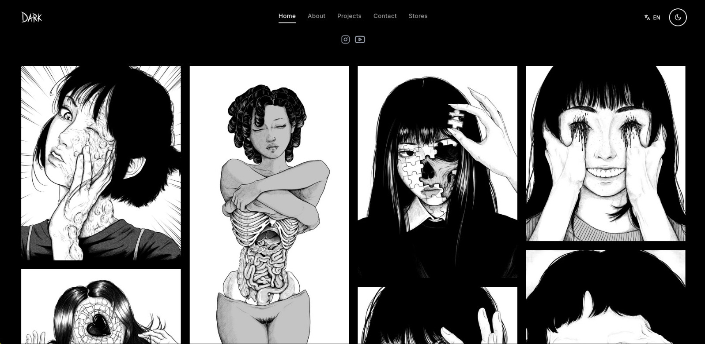
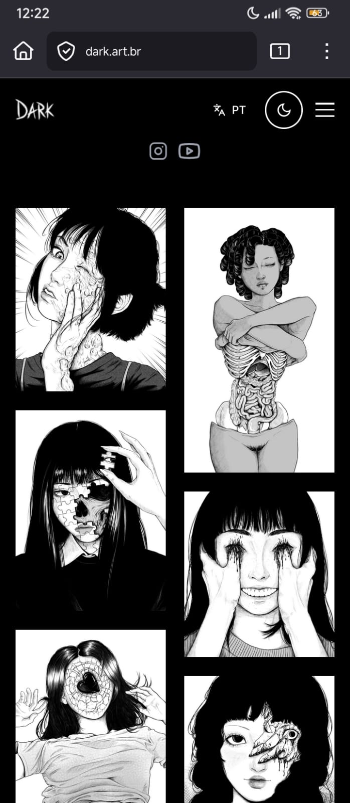

<div align="center">

# 🎨 Dark Portfolio

**Portfólio de ilustrações digitais especializado em horror e arte alternativa**

[](https://github.com/dionatha-goulart/dark-portfolio/actions/workflows/ci.yml)
[](LICENSE)
[](https://www.typescriptlang.org/)
[](https://reactjs.org/)
[](https://vitejs.dev/)
[](https://tailwindcss.com/)

</div>

---

## 📸 Preview

<div align="center">


<p><em>Página inicial - Galeria Masonry com ilustrações em destaque</em></p>


<p><em>Versão Mobile Responsiva</em></p>

</div>

---

## ✨ Funcionalidades

### 🎯 Principais Características

- **🌙 Dark/Light Mode** - Alternância automática entre temas
- **📱 Totalmente Responsivo** - Funciona perfeitamente em todos os dispositivos
- **⚡ Performance Otimizada** - Carregamento rápido com lazy loading e otimização de imagens
- **🖼️ Galeria Interativa** - Visualização de projetos com zoom e navegação
- **🌍 Internacionalização** - Suporte a múltiplos idiomas (PT/EN)
- **♿ Acessibilidade** - Seguindo padrões WCAG 2.1
- **🔍 SEO Otimizado** - Meta tags e estrutura otimizada para buscadores
- **📧 Formulário de Contato** - Integração com EmailJS para envio de mensagens

### 🛠️ Funcionalidades Técnicas

- **🚀 CI/CD Automatizado** - Deploy automático via GitHub Actions e Vercel
- **📊 Analytics Integrado** - Google Analytics para métricas
- **🖼️ Otimização de Imagens** - Cloudinary para compressão e transformação automática
- **🔒 TypeScript** - Tipagem estática para maior segurança
- **🎨 Tailwind CSS** - Framework CSS utilitário para design consistente
- **⚡ Vite** - Build tool ultra-rápido para desenvolvimento e produção

---

## 🏗️ Arquitetura do Projeto

```
src/
├── 📁 assets/              # Imagens, ícones e assets estáticos
│   ├── logo.webp
│   └── react.svg
├── 📁 core/                # Configurações principais
│   ├── App.tsx            # Componente raiz
│   ├── main.tsx           # Ponto de entrada
│   ├── providers/         # Context providers (Theme, I18n)
│   └── routing/           # Configuração de rotas
├── 📁 features/            # Funcionalidades específicas
│   ├── analytics/         # Google Analytics
│   └── gallery/           # Sistema de galeria
├── 📁 pages/              # Páginas da aplicação
│   ├── Home.tsx           # Página inicial
│   ├── About.tsx          # Sobre mim
│   ├── Projects.tsx       # Projetos
│   ├── Prints.tsx         # Impressões
│   ├── Contact.tsx        # Contato
│   └── Projetos/          # Páginas específicas de projetos
├── 📁 shared/             # Componentes e utilitários compartilhados
│   ├── components/        # Componentes reutilizáveis
│   ├── hooks/            # Custom hooks
│   ├── contexts/         # Contextos React
│   ├── utils/            # Funções utilitárias
│   └── translations/     # Arquivos de tradução
├── 📁 styles/             # Estilos globais
└── 📁 types/              # Definições TypeScript
```

---

## 📄 Páginas e Seções

### 🏠 Home

- **Galeria Masonry** - Grid responsivo com ilustrações em destaque
- **Carregamento Progressivo** - Lazy loading para otimização de performance
- **Modal de Zoom** - Visualização detalhada das obras
- **Navegação Intuitiva** - Interface limpa e focada na arte

### 👨‍💻 About

- **Apresentação Pessoal** - Informações sobre a ilustradora Dark
- **Especialização** - Horror com influências de mangá
- **Técnica** - Maestria em preto e branco
- **Mercado** - Foco em moda alternativa e produtos personalizados

### 🚀 Projects

- **8 Projetos Principais** - Faces of Horror, Macabre Faces, Killer Ladybugs, etc.
- **Grid Responsivo** - Layout adaptativo para diferentes telas
- **Navegação por Projeto** - Páginas individuais para cada trabalho
- **Categorização** - Horror, Fantasy, Halloween, Arachnophobia

### 🖼️ Stores (Prints)

- **Redbubble** - Roupas, adesivos e acessórios
- **INPRNT** - Prints de alta qualidade
- **Displate** - Pôsteres exclusivos
- **Portfolio** - Link para o portfólio principal
- **Doação** - Apoio ao trabalho da artista

### 📞 Contact

- **Formulário de Contato** - Integração com EmailJS
- **Informações de Contato** - Email para encomendas e colaborações
- **Mensagens de Sucesso/Erro** - Feedback visual para o usuário
- **Validação** - Campos obrigatórios e formatação de email

---

## 🛠️ Tecnologias Utilizadas

### Frontend

- **React 19.1.0** - Biblioteca de interface de usuário
- **TypeScript 5.9.2** - Tipagem estática para JavaScript
- **Vite 7.1.7** - Build tool e dev server ultra-rápido
- **Tailwind CSS 3.4.0** - Framework CSS utilitário
- **React Router DOM 7.9.3** - Roteamento client-side

### Ferramentas de Desenvolvimento

- **ESLint 9.36.0** - Linter para JavaScript/TypeScript
- **Prettier 3.5.3** - Formatador de código
- **PostCSS 8.4.35** - Processador CSS
- **Autoprefixer 10.4.17** - Prefixos CSS automáticos

### Deploy e CI/CD

- **GitHub Actions** - Automação de CI/CD
- **Vercel** - Deploy automático (integração nativa)
- **Lighthouse CI** - Análise de performance
- **Preview Deploys** - Deploy automático em PRs

### Integrações

- **Google Analytics (gtag)** - Métricas e analytics
- **EmailJS 4.4.1** - Envio de emails via formulário
- **Lucide React 0.544.0** - Ícones modernos
- **@fontsource/inter 5.2.6** - Fontes Inter otimizadas
- **Cloudinary** - Otimização e transformação de imagens

---

## 🚀 Como Executar

### Pré-requisitos

- Node.js 18 ou superior
- npm
- Git

### Instalação

```bash
# Clone o repositório
git clone https://github.com/dionatha-goulart/dark-portfolio.git

# Entre no diretório
cd dark-portfolio

# Instale as dependências
npm install

# Execute em modo desenvolvimento
npm run dev
```

### Scripts Disponíveis

```bash
# Desenvolvimento
npm run dev          # Servidor de desenvolvimento
npm run build        # Build para produção
npm run preview      # Preview do build

# Qualidade de Código
npm run lint         # Executar ESLint
```

---

## 🧪 CI/CD e Qualidade

### GitHub Actions

O projeto possui workflow automatizado de CI/CD:

- **Testes** - Verificação TypeScript, linting e build
- **Lighthouse** - Análise de performance em Pull Requests
- **Deploy Preview** - Deploy automático para branch `develop` e PRs
- **Deploy Production** - Deploy automático para branch `main`

### Ferramentas de Qualidade

- **TypeScript** - Verificação de tipos estática
- **ESLint** - Análise de código e padrões
- **Lighthouse CI** - Métricas de performance
- **Vercel** - Deploy automático e preview

---

## 🚀 Deploy

### Deploy Automático (Vercel)

O projeto está configurado para deploy automático na Vercel:

- **Produção**: Deploy automático na branch `main`
- **Preview**: Deploy automático em Pull Requests e branch `develop`
- **URL**: `https://dionatha.com.br`

### Configuração Vercel

- **Framework**: Vite
- **Node.js**: 18.x
- **Build Command**: `npm run build`
- **Output Directory**: `dist`
- **Install Command**: `npm ci`

### Configuração Automática

1. Conecte seu repositório no [Vercel Dashboard](https://vercel.com)
2. Configure as variáveis de ambiente necessárias
3. O deploy acontece automaticamente via GitHub Actions

### Workflows GitHub Actions

O projeto possui workflow automatizado:

- **CI/CD** (`ci.yml`) - Build, testes, Lighthouse e deploy automático

### Deploy Manual

```bash
# Build para produção
npm run build

# Deploy via Vercel CLI
npx vercel --prod
```

---

## 📊 Performance

- **Lighthouse Score**: Análise automática em Pull Requests
- **Otimização de Imagens**: Cloudinary para compressão automática
- **Lazy Loading**: Carregamento progressivo de imagens
- **Build Otimizado**: Vite para builds rápidos e eficientes

---

## 🔧 Configuração

### Variáveis de Ambiente

Crie um arquivo `.env.local` na raiz do projeto:

```env
# Google Analytics
VITE_GA_TRACKING_ID=G-XXXXXXXXXX

# EmailJS
VITE_EMAILJS_SERVICE_ID=service_xxxxxxx
VITE_EMAILJS_TEMPLATE_ID=template_xxxxxxx
VITE_EMAILJS_PUBLIC_KEY=xxxxxxxxxxxxxxx
```

### Personalização

- **Cores**: Edite `tailwind.config.js`
- **Fontes**: Configure em `src/styles/global.css`
- **Conteúdo**: Modifique os arquivos em `src/shared/translations/`
- **Imagens**: Adicione suas imagens em `src/assets/`
- **Projetos**: Configure em `src/pages/Projects.tsx`

---

## 📱 Responsividade

O portfólio é totalmente responsivo e otimizado para:

- **📱 Mobile** (320px - 768px)
- **📱 Tablet** (768px - 1024px)
- **💻 Desktop** (1024px - 1440px)
- **🖥️ Large Desktop** (1440px+)

---

## ♿ Acessibilidade

- **Navegação por teclado** - Totalmente acessível via teclado
- **Screen readers** - Compatível com leitores de tela
- **Contraste** - Cores com contraste adequado
- **Foco visível** - Indicadores de foco claros
- **Alt text** - Textos alternativos para imagens

---

## 🌍 Internacionalização

Suporte completo a múltiplos idiomas:

- **🇧🇷 Português** - Idioma padrão
- **🇺🇸 English** - Tradução completa
- **🔄 Troca dinâmica** - Sem recarregar a página
- **📝 Fácil adição** - Novos idiomas facilmente adicionáveis

---

## 📈 Analytics

Integração completa com Google Analytics:

- **Page views** - Visualizações de páginas
- **User interactions** - Cliques e interações
- **Image interactions** - Cliques em imagens e modais
- **Custom events** - Eventos personalizados

---

## 📄 Licença

**⚠️ ATENÇÃO: Este projeto é de uso exclusivo e pessoal.**

### Direitos Reservados

Este software e sua documentação são propriedade exclusiva do autor e estão protegidos por direitos autorais. É **expressamente proibido**:

- ❌ **Copiar** o código fonte
- ❌ **Modificar** sem autorização
- ❌ **Distribuir** o software
- ❌ **Usar** para fins comerciais
- ❌ **Criar trabalhos derivados**
- ❌ **Fazer engenharia reversa**

### Uso Permitido

- ✅ **Visualizar** o código para fins educacionais
- ✅ **Estudar** a implementação para aprendizado
- ✅ **Inspirar-se** nas ideias e conceitos
- ✅ **Fazer fork** apenas para estudo pessoal

### Consequências

A violação desta licença resultará em:

- Ação legal imediata
- Remoção do conteúdo infrator
- Danos e prejuízos conforme a lei

**© 2025 Dionatha Goulart. Todos os direitos reservados.**

---

## 📞 Contato

**Desenvolvedor**: Dionatha Goulart  
**Email**: dionatha.work@gmail.com  
**Portfolio**: https://dionatha.com.br  
**GitHub**: https://github.com/dionatha-goulart

---

<div align="center">

**Feito com ❤️ e muito ☕ por Dionatha Goulart**

⭐ Se este projeto te inspirou, considere dar uma estrela!

</div>
